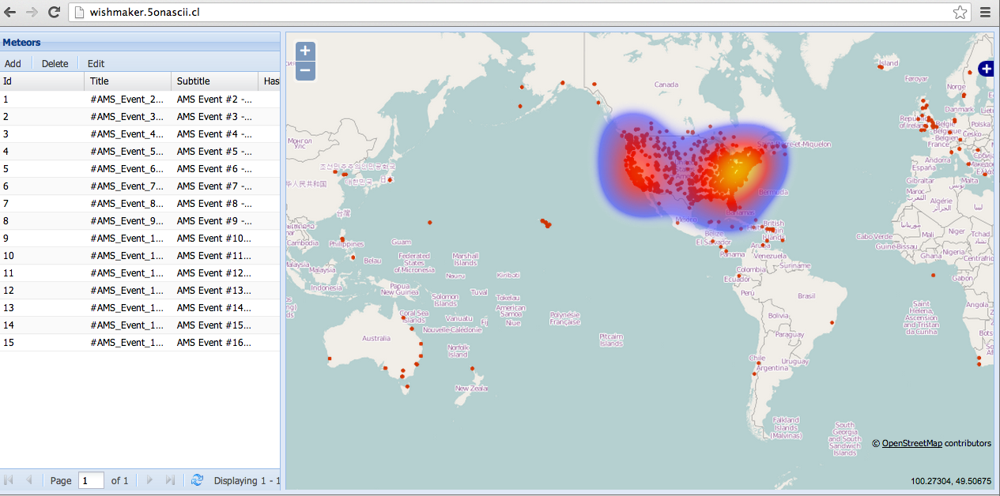
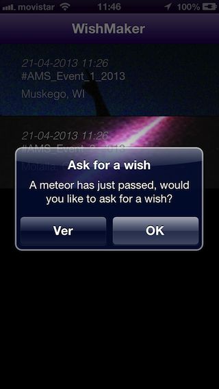
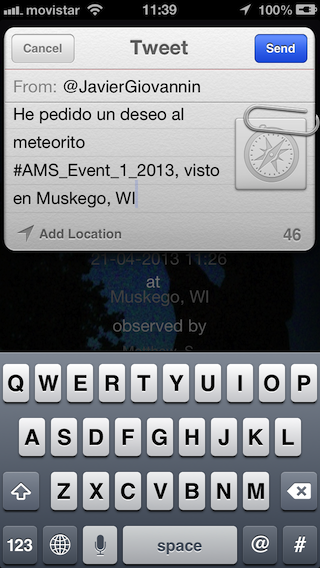

Catch a Meteor Tracker

# WishMaker

WishMaker is an application to explore different meteor sightings' and help you 'make a wish' right on your mobile phone.

# Business Objective
* Promote meteorite information and, in turn, the interest on sighting meteorites. 

# Project Objectives
* Use open source technologies
* Develop a native WishMaker system for iOS and Android
* Develop web services with meteorite information

# System Objectives
* Notice people about new sightnings
* Inform people about sightnings

# User Experience Example
* Whenever you explore these meteorite sightings you can have a look at interesting information about them. When you've picked your favorite sighting, you can 'make a wish' and tweet it from your mobile so your friends know about it.

The Web Interface

Screenshots de la app en iPhone

Screenshots de la app en Android

